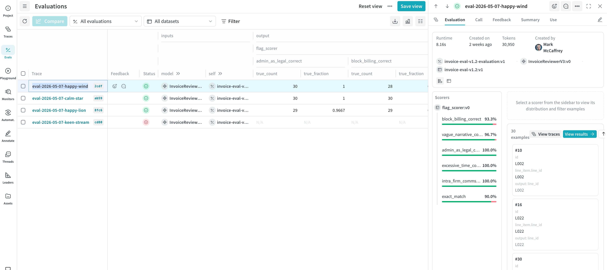

# Invoice Review Assistant — POC

An AI-powered legal invoice line-item reviewer. A small-scale build working through the full AI product lifecycle: rules definition, labelled eval sets, prompt iteration with measured trade-offs, and grounded outputs.

> ⚠️ **POC, not production.** Single-line review only. 30-line eval set. No RAG, no multi-document reasoning, no UI. The point of this repo is the *methodology*, not the artifact.

---

## What this is

A reviewer that takes a single legal invoice line item — narrative, hours, rate, timekeeper — and returns structured JSON identifying which billing rules it violates, with severity and a verbatim quote from the narrative grounding each flag.

```
Input  →  "Photocopying discovery documents — 0.5 hrs @ $750"
Output →  {
            "flags": [{
              "rule": "admin_as_legal",
              "severity": "high",
              "quoted_text": "Photocopying discovery documents",
              "reasoning": "Photocopying is clerical work; not billable at partner rate."
            }]
          }
```

Five rules in scope: `block_billing`, `vague_narrative`, `admin_as_legal`, `excessive_time`, `intra_firm_comms`.

Built on Claude Haiku 4.5 via the Anthropic API. ~$0.0004 per line reviewed.

---

## Why these decisions

### Eval set first, prompt second

Before writing any prompt, I wrote the rules in plain English with positive *and* negative examples, then built a labelled 30-line eval set covering single-rule violations, multi-rule violations, clean lines, and deliberate "trap" lines (entries that look flag-worthy but aren't, designed to surface over-flagging).

The eval set is version-controlled (v1.0 → v1.1 → v1.2) with a written change log explaining each label revision. The most important revision: after running the model against v1.1, I found the model was *right* on 5 of 8 disagreements — my eval set was under-labelling. Re-labelling raised accuracy from 73% to 90% with no prompt changes.

**Eval sets are hypotheses, not ground.**

### Rules as a parameter, not hardcoded

The reviewer's signature is `review(line_item, rules, client_id="default")`. Rules are passed in, not baked into the prompt. This is a deliberate hook for client-specific Outside Counsel Guidelines (see [`design-memos/client-specific-rules.md`](design-memos/client-specific-rules.md) for how this would extend to RAG).

### Prompt iteration tracked, not hand-waved

Three prompt versions, each with a single isolated change so cause-of-effect is readable:

| Version | Change | Eval accuracy | Notable trade-off |
|---------|--------|--------------:|-------------------|
| v1 | Baseline: rules + JSON schema instruction | 90.0% | 3 false positives on "trap" lines (model conflates high hours with excessive, and clerical-sounding verbs with admin work) |
| v2 | + 3 few-shot examples teaching contextual justification | 93.3% | Fixed 3 v1 FPs but introduced 2 new FPs on rules the examples didn't touch — *prompt changes propagate beyond their target* |
| v3 | + verbatim quote requirement (`quoted_text` per flag) | 90.0% | 100% verbatim quote rate; zero false positives across all 30 lines; 3 false negatives on `block_billing` (the rule resists span-grounding because the violation is structural, not local) |

_Numbers are from a single run with temperature=0. Re-runs show ±1 line variance on borderline cases (L021, L030, L003 in particular) — temperature=0 is a "most likely token" guarantee, not bit-level reproducibility. Weave dashboards show live eval runs and capture this variance directly._



There is no winner. v2 has the highest F1; v3 has the cleanest verifiability and zero FPs but lower recall. Choosing between them is a product decision: **which failure mode is more costly?** In legal billing, false negatives (money walks out unflagged) erode trust faster than false positives (annoying but recoverable).

### Guardrail at two layers

The verbatim-quote requirement exists in both:

1. **Prompt instruction** — model is told to copy phrases verbatim from the narrative.
2. **Code-level validation** — after parsing, each `quoted_text` is checked against the narrative as a substring. Failures are flagged, not silently dropped.

Lesson, repeated and earned: **prompts reduce failure rates; code enforces correctness.** Earlier in the build, I quantified that Haiku ignores a "no markdown code fences" instruction 100% of the time — the script only worked because of a small post-processor that strips fences before parsing. Same lesson, different layer.

### What v3 surfaced (the senior insight)

The 100% substring-verification rate is real but partly cosmetic. The model often quotes the *entire narrative* to satisfy the substring check rather than localising the violation. A v4 fix would constrain quote length relative to narrative length, or require distinct spans for distinct flags on multi-flag lines.

The lesson: **a guardrail enforces what it measures, not what you mean.** Substring presence ≠ targeted grounding. Worth knowing before designing the next one.

---

## What's deliberately out of scope

Scoping decisions, with reasons:

- **Cross-line analysis** — the original rules list included "duplicate billing." Dropped early because it requires comparing line items to each other, which is a different architecture. Single-line review is the contract.
- **Severity scoring** — severity is reported per flag but not scored against ground truth. A 3-level scale (`low/medium/high`) needs different evaluation methodology (probably LLM-as-judge with rubric); deferred.
- **Tool use for structured output** — chose prompt-engineered JSON over Anthropic's tool-use API. Simpler, sufficient, with a known failure rate handled by the post-processor. Tool use would be the upgrade if format reliability became a recurring problem.
- **Building v4** — v3 surfaced a real follow-up (quote-quality vs quote-presence). Naming the design issue is the artifact; building it would be marginal at this scale.
- **Client-specific rules / RAG** — described in a design memo; not implemented. The reviewer's `client_id` parameter is the architectural hook.

---

## Repository structure

```
.
├── reviewer.py                                  # Core reviewer: review(line_item, rules, client_id)
├── run_eval.py                                  # Runs reviewer over the eval set, scores P/R/F1
├── weave_eval.py                                # Weave-native eval: Model classes, scorer, Evaluation runner
├── invoice_eval_set_v1.xlsx                     # Labelled ground truth (v1.1 + v1.2 sheets, rules reference, change log)
├── invoice_eval_set_v1_with_v1_results.xlsx     # v1 eval set scored with the v1 prompt
├── invoice_eval_set_v1.2_with_v1_results.xlsx   # v1.2 eval set scored with the v1 prompt
├── invoice_eval_set_v1.2_with_v2_results.xlsx   # v1.2 eval set scored with the v2 prompt
├── invoice_eval_set_v1.2_with_v3_results.xlsx   # v1.2 eval set scored with the v3 prompt
├── design-memos/
│   └── client-specific-rules.md                 # 1-page memo: how the reviewer would extend with RAG
└── README.MD
```

The xlsx files are the most useful place to start if you want to see how the work actually went. The `Change Log` tab in the eval set explains the v1.1 → v1.2 reasoning. The results file has every line, every prediction across three prompt versions, every quote.

---

## Setup

```bash
# Clone and enter
git clone https://github.com/mccaffreym/invoice-review-poc.git
cd invoice-review-poc

# Virtual environment
python3 -m venv .venv
source .venv/bin/activate

# Install
pip install anthropic python-dotenv pandas openpyxl

# API key
echo "ANTHROPIC_API_KEY=your-key-here" > .env

# Run
python run_eval.py
```

Requires Python 3.9+ and an Anthropic API key. Cost to run the full eval (30 lines × 1 prompt version) is roughly $0.01.

---

## What I'd build next

In priority order:

1. **Quote-quality v4** — constrain `quoted_text` length and require distinct spans for distinct flags on multi-flag lines. Targeted fix for the v3 finding.
2. **LLM-as-judge for explanation quality** — evaluate the *reasoning* field, not just flag presence. Stronger model as judge than reviewer; validate the judge against human judgement on a small sample before trusting aggregate scores.
3. **Client-specific rules via RAG** — per the design memo. The architectural hooks (`client_id` parameter, schema with `source` field) are already in place.
4. **Continuous evaluation** — eval sets at production scale come from human reviewer feedback, not hand-curation. The 30-line spreadsheet doesn't scale; the methodology does.

---

## Stack

- **Model:** Claude Haiku 4.5 (`claude-haiku-4-5`) via Anthropic API
- **Language:** Python 3.13
- **Eval tracking:** Excel + Weights & Biases Weave (tracing and evaluation)
- **Workflow:** Claude Code for scaffolding, Claude (chat) for design decisions and review

---

*Built by Mark McCaffrey. Feedback welcome.*
